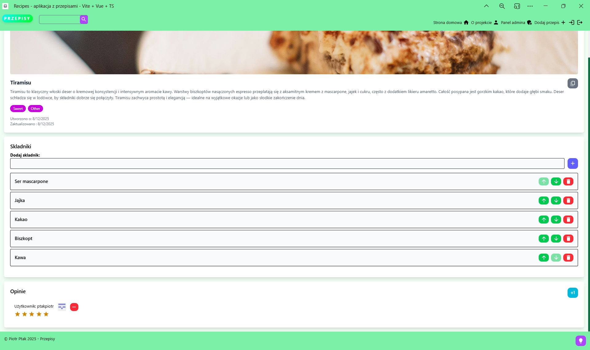

# Recipes

## Table of contents

- [General info](#general-info)
- [Technologies](#technologies)
- [Examples](#examples)

## General info

Progressive web app for sharing favorite recipes. Solution (on the backend side) follows modular monolith architecture & 'Clean architecture' style.
Frontend includes Vue.js & TypeScript usage. Infrastructure provisioned via Terraform or as Kubernetes' objects.
Project utilizes AI for sentiment analysis & recipes generation (RAG).
## Technologies

- ASP.NET 8
- Vue.js 3
- TypeScript
- AI (sentiment analysis & RAG)
- Docker & Kubernetes
- Github authentication (OIDC)
- Terraform

## Examples

